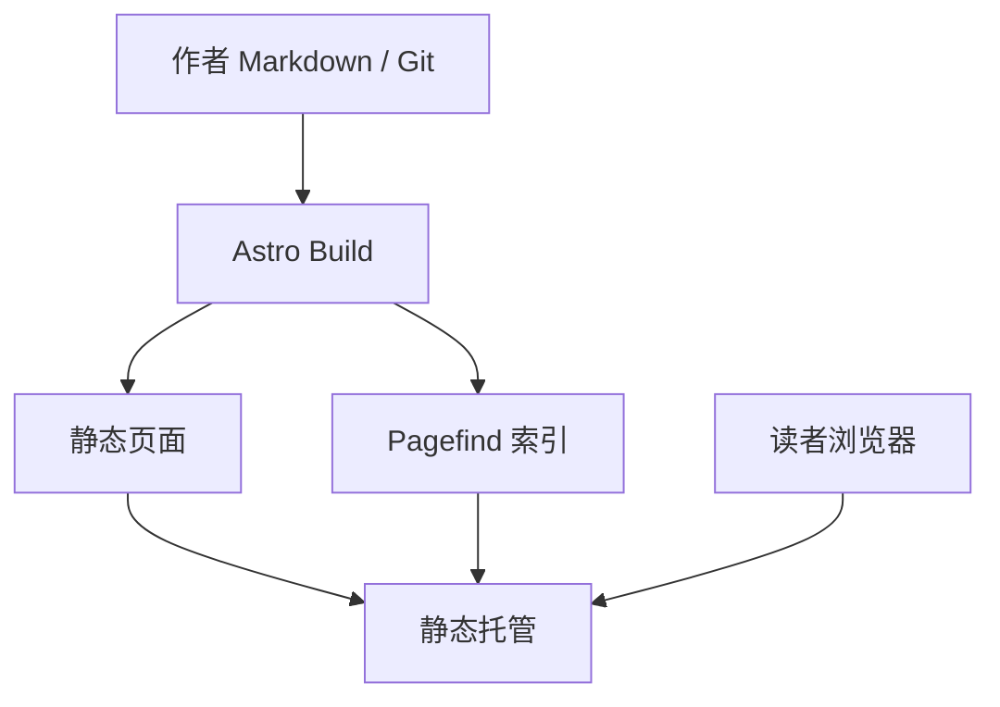
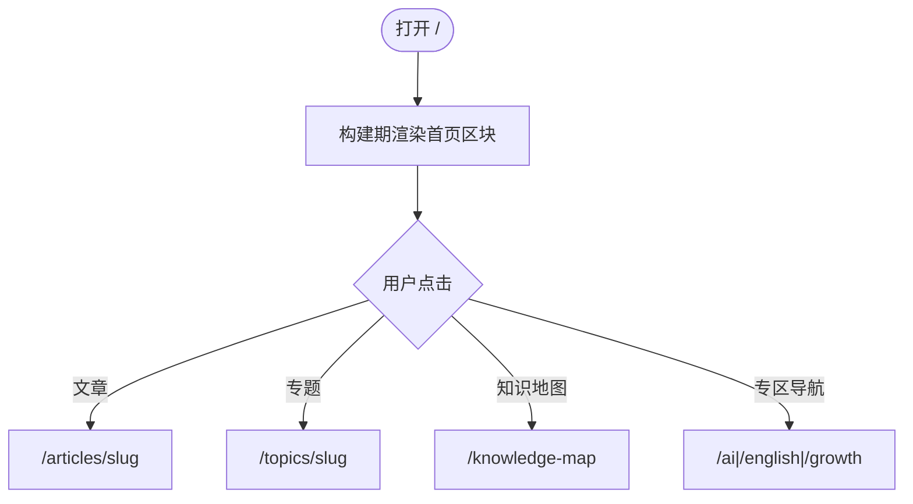
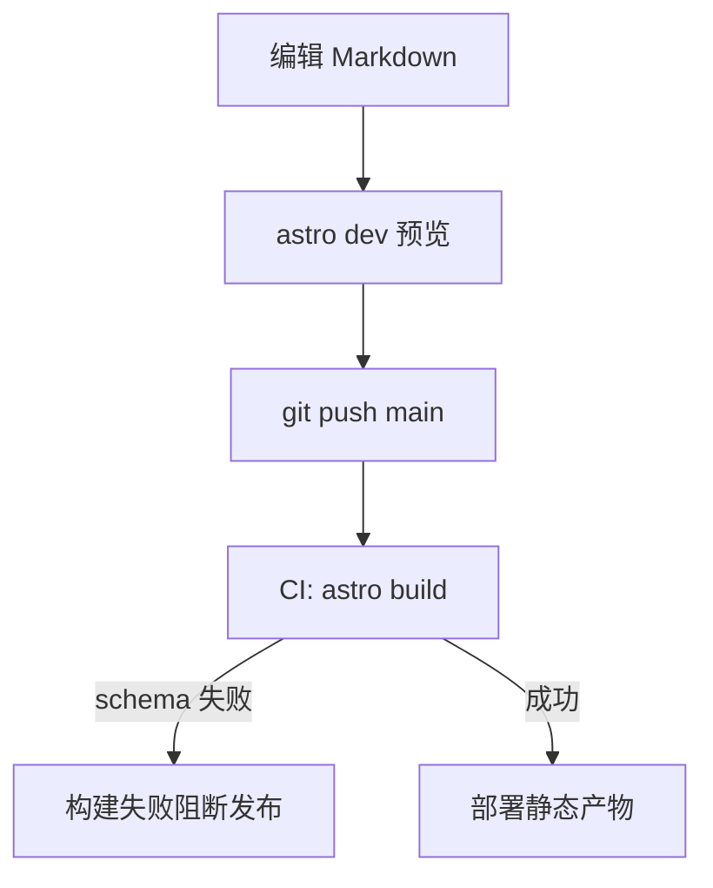
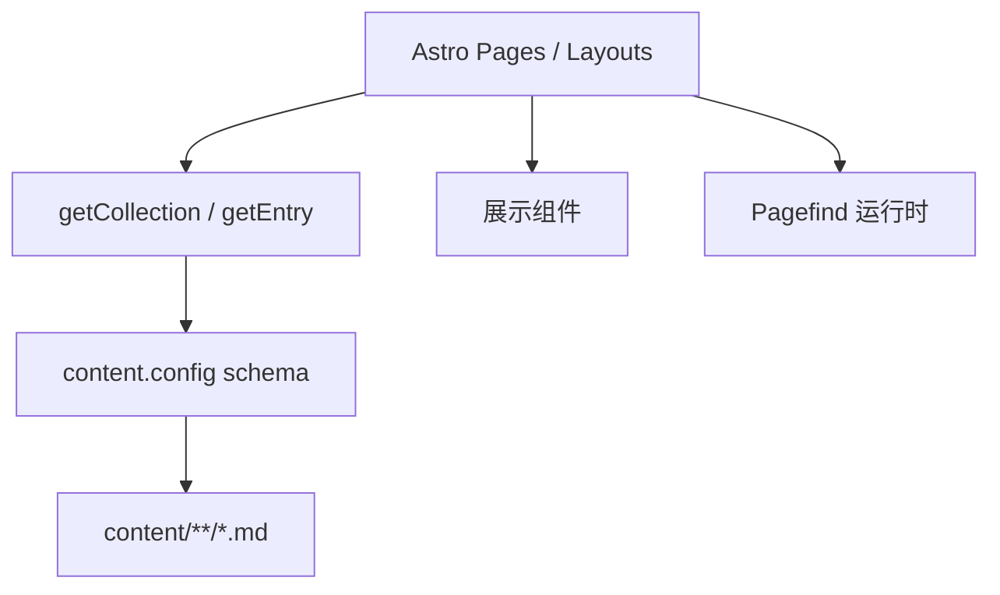
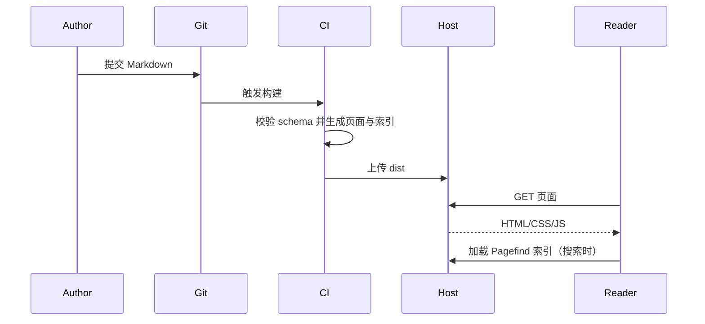
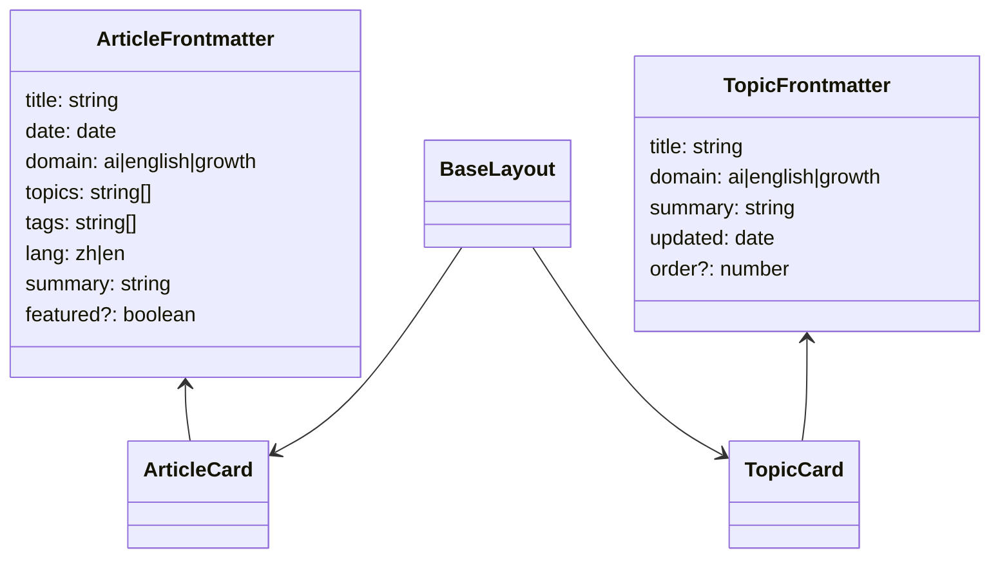

# 修订记录

| 日期 | 内容 | 修改人 |
|------|------|--------|
| 2026-08-19 | 初稿（个人公开知识站 / Astro 方案） | Agent |

## 文档头

| 条目 | 内容 |
|------|------|
| 设计标识 | SPEC-KNOW-20260819 |
| 功能/文档名称 | 个人公开知识站（AI / 英语 / 成长） |
| 文档类型 | 详细设计文档（Web 静态站；章节沿用移动端详细设计模板结构） |
| 版本信息 | V1.0 |
| 平台范围 | Web（桌面浏览器 + 移动浏览器）；构建产物为静态站点 |
| 上游文档 | 参考站 https://www.80aj.com/；本轮 brainstorming 决策（专题为主、Markdown 发布、首页布局 A、方案 Astro） |
| 下游文档 | 实施计划（writing-plans）、代码实现、自测试报告 |

## 目录

1. 需求与约束（设计输入）
2. 方案调研与方案选择
3. 模块划分与功能设计
4. 接口与数据设计
5. 流程与状态
6. 其它
7. 兼容性（平台兼容性、版本兼容性、发布兼容性）
8. 变更清单
9. 自测试方案
10. 各代码文件修改说明

---

# 1. 需求与约束（设计输入）

## 1.1 功能背景与模块定位

在空仓库 `cxqin_workspace` 从零搭建个人公开知识站，信息架构与阅读气质参考 80aj（工程笔记本 / 知识库），内容聚焦三类：AI 知识梳理、英语打开学习、个人成长记录。站点以专题 / 知识地图组织内容，作者在仓库内用 Markdown 写作并构建发布。

| 条目 | 内容摘要 |
|------|----------|
| 功能目标 | 提供可公开访问的知识阅读站：按三大领域浏览、按专题系统学习、全文搜索与归档回看 |
| 用户场景 | 读者从首页/专区/专题进入文章；作者本地写 Markdown 后推送部署 |
| 功能范围 | 首页（布局 A）、三大专区、文章详情、专题列表/详情、知识地图、标签、归档、搜索、关于页；Astro Content Collections + Pagefind；静态托管 |
| 非目标 | 评论、登录后台、学习进度看板、完整 i18n 切换器、Obsidian/Notion 自动同步、后端 API、赞助/Token 消耗看板（参考站能力不迁入 V1） |
| 约束条件 | 个人公开站；无服务端运行时；内容源仅仓库 Markdown；英语专区可放英文原文，其余以中文为主；顶栏含三大领域入口 |
| 验收标准 | `astro build` 成功；样例覆盖三域与 ≥2 专题；首页 A 区块齐全；专区/专题/文章/标签/归档/知识地图/搜索可点通；Pagefind 可检索；移动端可读；主分支部署后公网可访问 |

**成功标准**：读者 3 次点击内能从首页进入任一域下的一篇样例文；作者新增一篇 Markdown 并推送后，线上可见且可被搜索命中。

**主要成功路径**：首页 → 专区或专题 → 文章详情。

**重要失败路径**：frontmatter 非法导致构建失败；专题无文章显示空态；未知 slug 显示 404；搜索无结果引导回知识地图。

# 2. 方案调研与方案选择

| 方案编号 | 方案要点 | 优点 | 缺点 | 适用条件 |
|----------|----------|------|------|----------|
| 方案A | Astro + Content Collections + Pagefind 静态搜索 | 内容站一等公民、构建快、部署简单、贴近 Markdown 工作流 | 复杂交互看板需另铺客户端岛 | 个人公开知识站、V1 只读 |
| 方案B | Next.js App Router + MDX | 后续交互/后台扩展方便 | 对纯静态阅读站偏重 | 明确要上交互看板或 CMS |
| 方案C | VitePress 文档站骨架 | 上手快 | 博客首页/专题卡/三域顶栏不自然 | 纯文档手册 |

**选定方案**：方案 A（Astro + Content Collections + Pagefind）  
**选择依据**：与已定「Markdown 发布 + 专题为主 + 个人公开站」一致；静态产物易托管；英语专区用 `lang` 字段即可，无需整站 i18n。

# 3. 模块划分与功能设计

## 3.1 页面与模块划分

| 页面/模块 | 职责简述 | 所属平台 | 备注 |
|-----------|----------|----------|------|
| 全局 Layout / Nav | 站点名、AI、英语、成长、专题、搜索入口；页脚关于 | Web Shared | 移动端折叠导航 |
| 首页 `/` | 今日观点、最新文章、热门专题、专题精选/知识地图入口（布局 A） | Web | |
| 专区 `/ai` `/english` `/growth` | 该域文章列表 + 该域专题条 | Web | |
| 专题列表 `/topics` | 全部专题卡片 | Web | |
| 专题详情 `/topics/[slug]` | 简介 + 关联文章目录 | Web | |
| 知识地图 `/knowledge-map` | 按域分组的专题总览 | Web | |
| 文章详情 `/articles/[slug]` | 正文、域/标签、所属专题、相关篇 | Web | |
| 标签 `/tags/[tag]` | 同标签文章列表 | Web | |
| 归档 `/archive` | 按年月折叠列表 | Web | |
| 搜索 `/search` | Pagefind UI | Web | 构建期索引 |
| 关于 `/about` | 站点说明 | Web | `content/pages/about.md` |
| 404 | 未知路由兜底 | Web | |
| Content schema | articles / topics Zod 校验 | Build-time | |
| 部署流水线 | push 主分支 → 构建 → 静态托管 | CI | |

## 3.2 软件系统上下文定义

**上游依赖（调用本功能）**：
- 读者浏览器：访问静态 URL
- 作者 Git 推送 / CI：触发构建与发布

**下游依赖（本功能调用）**：
- 文件系统 `content/**`：构建时读取 Markdown
- Pagefind：构建后生成搜索索引与运行时脚本
- 静态托管（GitHub Pages / Cloudflare Pages / Vercel 静态）：分发 HTML/CSS/JS/索引

**数据流**：作者写入 Markdown → Astro 构建生成页面与 Pagefind 索引 → CDN/托管提供给读者；运行时无后端写路径。

**模块上下文图**：



## 3.3 名词解释与缩略语

### 术语

- **Domain（领域）**：顶栏三大专区之一，取值 `ai` | `english` | `growth`
- **Topic（专题）**：某一域下的主题资料库，聚合多篇文章
- **Article（文章）**：单篇 Markdown 长文
- **Knowledge Map（知识地图）**：全部专题按域分组的总览页
- **今日观点**：首页短句入口，链到一篇文章或固定配置文案

### 缩略语

- **SSG**：Static Site Generation（静态站点生成）
- **CI**：Continuous Integration（持续集成）

## 3.4 设计思路

采用 Astro SSG：页面在构建期从 Content Collections 取数渲染。无客户端全局状态管理；搜索为 Pagefind 客户端组件（Astro island 或静态脚本）。样式使用站点级 CSS 变量，阅读优先、避免卡片堆砌仪表盘感；首页遵循布局 A（观点 + 最新 + 热门专题 + 知识地图入口）。

站点显示名暂定「知识台」（可在实现前替换品牌文案，不改路由结构）。

### 3.4.1 设计可选方案

| 方案 | 技术复杂度 | 性能开销 | 扩展性 | 优势 | 劣势 |
|------|------------|----------|--------|------|------|
| 方案A Astro SSG | 低 | 低 | 中（交互需加岛） | 贴合内容站 | 动态能力弱 |
| 方案B Next SSG/SSR | 中 | 中 | 高 | 易加交互 | V1 过重 |
| 最终方案 | 低 | 低 | 中 | 选 A | 看板类后置 |

## 3.5 功能/流程说明

### 3.5.1 功能1：首页浏览（布局 A）

**功能描述**：展示今日观点、按日期倒序最新文章（跨域）、热门专题（按 `updated` 或文章数）、专题精选区与知识地图入口。点击进入对应详情。

**流程图**：



### 3.5.2 功能2：专区浏览

**功能描述**：按 `domain` 过滤文章与专题；英语专区正文可按 `lang=en` 展示英文原文，不做机翻。

### 3.5.3 功能3：专题与知识地图

**功能描述**：专题详情列出 `topics` 含该 slug 的文章；知识地图按三域分组展示全部专题卡片。专题无文章时显示空态与回链。

### 3.5.4 功能4：搜索与归档

**功能描述**：搜索页加载 Pagefind；归档按年-月分组列出全部文章。标签页按 tag 过滤。

### 3.5.5 功能5：作者发布

**功能描述**：在 `content/` 新增/修改 Markdown → 本地 `astro dev` 预览 → 推送主分支 → CI `astro build` + 部署。非法 frontmatter 使构建失败。

**流程图**：



## 3.6 模块分层图



无 ViewModel / Repository / Remote API 层。

## 3.7 模块交互时序图



## 3.8 开发视图：目录与类/文件职责

当前仓库除 `README.md` 外无应用源码；下列均为**新增**。

### 3.8.1 文件命名规则与示例目录树

| 规则项 | 约定 |
|--------|------|
| 页面文件命名 | Astro 文件路由：`src/pages/**/*.astro` |
| 内容文件命名 | kebab-case slug：`content/articles/my-post.md` |
| 组件命名 | PascalCase：`ArticleCard.astro` |
| 测试文件命名 | `*.test.ts`（若引入 vitest）；V1 以构建与手工验收为主 |

```text
/
  package.json
  astro.config.mjs
  tsconfig.json
  src/
    content.config.ts
    layouts/BaseLayout.astro
    components/
      SiteHeader.astro
      ArticleCard.astro
      TopicCard.astro
      DomainNav.astro
    pages/
      index.astro
      ai.astro
      english.astro
      growth.astro
      topics/index.astro
      topics/[slug].astro
      knowledge-map.astro
      articles/[slug].astro
      tags/[tag].astro
      archive.astro
      search.astro
      about.astro
      404.astro
    styles/global.css
  content/
    articles/
    topics/
    pages/about.md
  public/
  .github/workflows/deploy.yml
```

### 3.8.2 类关系设计



## 3.9 关键逻辑说明

1. **首页最新**：`getCollection('articles')` 按 `date` 降序取前 N（默认 10）。
2. **热门专题**：专题按关联文章数降序，同分按 `updated` 降序，取前 M（默认 5）。
3. **专区过滤**：`article.data.domain === domain`；专题同理。
4. **专题文章列表**：文章 `topics` 数组包含专题 `id`（文件名 slug）。
5. **今日观点**：优先取 `featured: true` 的最新一篇的 `summary`；若无则取全局最新一篇 `summary`。
6. **相关文章**：同专题优先，否则同域，排除当前篇，最多 3 篇。

## 3.10 核心算法或策略设计

| 算法/策略 | 时间复杂度 | 空间复杂度 | 说明 |
|-----------|------------|------------|------|
| 专题热度排序 | O(A + T log T) | O(T) | A=文章数，T=专题数；构建期一次性计算 |
| 归档分组 | O(A) | O(A) | 按 `YYYY-MM` 分组后键排序 |
| Pagefind 索引 | 构建期外部工具 | 随语料增长 | 不自研检索 |

# 4. 接口与数据设计

## 4.1 对外接口表

无 HTTP 业务 API。对外为页面路由与构建期内容查询。

| 接口名 | 入参 | 出参 | 说明 | 备注 |
|--------|------|------|------|------|
| 路由 `/` 等 | URL | HTML | 静态页 | |
| `getCollection('articles')` | 无 | ArticleEntry[] | Astro Content API | 仅构建/SSR 期 |
| `getCollection('topics')` | 无 | TopicEntry[] | 同上 | |
| Pagefind `search(q)` | 查询字符串 | 命中列表 | 浏览器端 | 官方 UI/API |

## 4.2 API 与数据模型定义

**Article frontmatter（Zod）**

| 字段 | 类型 | 必填 | 说明 |
|------|------|------|------|
| title | string | 是 | 标题 |
| date | date | 是 | 发布日期 |
| domain | enum | 是 | `ai` \| `english` \| `growth` |
| topics | string[] | 否 | 专题 slug 列表，默认 `[]` |
| tags | string[] | 否 | 默认 `[]` |
| lang | enum | 否 | `zh` \| `en`，默认 `zh` |
| summary | string | 是 | 摘要/列表展示 |
| draft | boolean | 否 | 默认 `false`；`true` 则生产构建排除 |
| featured | boolean | 否 | 参与今日观点优选 |

**Topic frontmatter**

| 字段 | 类型 | 必填 | 说明 |
|------|------|------|------|
| title | string | 是 | |
| domain | enum | 是 | |
| summary | string | 是 | |
| updated | date | 是 | |
| order | number | 否 | 知识地图同域内排序，默认 0 |

正文为 Markdown；文章 `id` = 文件名（不含扩展名）。

## 4.3 本地存储与缓存

不涉及（无用户端持久化业务数据；浏览器仅缓存静态资源）。

## 4.4 配置项与常量

| 配置项/常量 | 类型 | 默认值 | 说明 |
|-------------|------|--------|------|
| SITE_TITLE | string | 知识台 | 品牌显示名 |
| HOME_LATEST_COUNT | number | 10 | 首页最新条数 |
| HOME_HOT_TOPICS | number | 5 | 首页热门专题数 |
| RELATED_ARTICLES | number | 3 | 文末相关篇数 |
| DOMAINS | const | ai/english/growth | 合法域 |

## 4.5 错误码与错误态映射

| 错误来源 | 错误码/条件 | UI 状态 | 用户提示 | 处理方式 |
|----------|-------------|---------|----------|----------|
| Schema 校验 | Zod 失败 | 构建失败 | CI 日志字段错误 | 阻断发布 |
| 文章引用未知 topic | 构建警告或失败 | 构建失败（严格模式） | 提示非法 topic slug | 配置为 fail |
| 专题无文章 | 空集合 | empty | 「暂无文章，去专区看看」 | 链到对应 domain |
| 未知 slug | 无 entry | 404 | 「页面不存在」 | 链首页与三域 |
| 搜索无命中 | 空结果 | empty | 「换个关键词」 | 链知识地图 |
| Pagefind 资源缺失 | 本地未 build | error | 「搜索索引未生成」 | 提示先 build |

## 4.6 接口规格补充

不涉及 HTTP 业务接口。Pagefind 按官方静态集成方式挂载到 `/search`；生产环境需保证 `_pagefind/`（或配置目录）与站点同域可访问。

# 5. 流程与状态

## 5.1 主流程与异常分支

- **读者正常**：导航 → 列表/地图 → 详情 →（可选）搜索/标签/归档。
- **读者异常**：404、空专题、搜索无结果（见 4.5）。
- **作者正常**：编辑 → 预览 → 推送 → 上线。
- **作者异常**：schema 失败则修复 frontmatter 后重推。

## 5.2 页面状态或业务状态

| 状态名 | 含义 | 进入条件 | 退出/转移条件 |
|--------|------|----------|---------------|
| content | 有可展示条目 | 集合非空 | — |
| empty | 无条目 | 过滤结果为空 | 用户跳转其它页 |
| not_found | 资源不存在 | slug 无匹配 | 404 页 |
| search_idle | 搜索未输入 | 打开搜索页 | 输入触发检索 |
| search_empty | 无命中 | 查询无结果 | 改关键词 |
| build_error | 仅 CI/本地构建 | schema/编译失败 | 修复后重建 |

静态站无 loading 骨架网络态；搜索输入后的短暂等待由 Pagefind UI 自行处理。

## 5.3 超时、重试与节流参数

不涉及（无业务轮询/上传）；搜索防抖采用 Pagefind UI 默认行为。

## 5.4 流程伪代码

```text
function articlesForTopic(topicId):
  return articles
    .filter(a => !a.data.draft && a.data.topics.includes(topicId))
    .sortBy(date desc)

function hotTopics(limit):
  scores = topics.map(t => (t, count(articlesForTopic(t.id))))
  return sort scores by count desc, updated desc
    .take(limit)

function validateArticle(a):
  assert a.data.domain in DOMAINS
  for tid in a.data.topics:
    assert topicExists(tid)  // 严格模式失败构建
```

## 5.5 生命周期与前后台处理

不涉及 App 生命周期。浏览器刷新即重新请求静态资源。

## 5.6 线程、协程与并发

不涉及；构建单进程；浏览器搜索在主线程由 Pagefind 执行。

## 5.7 数据处理与访问控制

全部公开可读；`draft: true` 仅在 `astro build` 生产配置中排除。无鉴权、无敏感字段存储。

## 5.8 依赖性描述

1. Node.js + npm/pnpm 安装依赖  
2. 先有合法 `content/` 再构建  
3. 部署任务依赖 `astro build` 成功与 Pagefind 索引生成  
4. 无系统权限 / 原生 SDK

# 6. 其它

## 6.1 假设、未决项与风险

| 类型 | 内容 | 处理建议 |
|------|------|----------|
| 假设 | 站点品牌文案可用「知识台」占位 | 实现前可改 `SITE_TITLE` 与关于页 |
| 假设 | 托管选 Cloudflare Pages 或 GitHub Pages 其一即可 | 实施计划中默认 Cloudflare Pages；可替换 |
| 未决项 | 自定义域名 | 不阻塞 V1；有域名后再配 DNS |
| 风险 | 专题 slug 重命名导致断链 | 约定 slug 稳定；必要时加 redirects |
| 风险 | 内容增多后首页「热门」启发式不准 | V1 可接受；后续可加手工 `pinned` |

## 6.2 参考资料

- （参考站）：https://www.80aj.com/
- （方案决策）：本会话 brainstorming（布局 A、方案 A、语言 4C、导航 5A）
- （相关代码）：仓库当前无应用源码；见第 10 章新增清单

## 6.3 附件

不涉及（Visual Companion 线框存于 `.appflow/brainstorm/`，不纳入产品交付）。

# 7. 兼容性（平台兼容性、版本兼容性、发布兼容性）

## 7.1 平台兼容性

| 平台 | 兼容性说明 | 备注 |
|------|------------|------|
| Android | 不涉及原生 App；手机 Chrome/系统浏览器访问响应式 Web | |
| iOS | 不涉及原生 App；Safari 移动端可读、折叠导航可用 | |
| Flutter/React Native | 不涉及 | |
| 桌面浏览器 | 近两年 Chrome / Edge / Firefox / Safari | |

## 7.2 版本与升级兼容性

| 变更类型 | 兼容策略 | 备注 |
|----------|----------|------|
| frontmatter 增字段 | 新字段可选 + 默认值 | 旧文无需立刻改 |
| 路由变更 | 尽量保持 `/articles/[slug]` 稳定 | 破坏性变更写 redirects |
| Astro 大版本 | 按官方迁移指南升级 | lockfile 锁定次版本 |

## 7.3 发布与审核兼容性

不涉及应用商店审核。静态托管公开访问；无隐私权限弹窗。若使用统计脚本（V1 默认不加），需在关于页披露。

# 8. 变更清单

| 变更项 | 变更类型 | 说明 | 备注 |
|--------|----------|------|------|
| Astro 知识站工程 | 新增 | 从空仓库初始化 | |
| 内容模型 articles/topics | 新增 | Zod schema + 样例内容 | |
| 页面与导航 | 新增 | 三域顶栏 + 布局 A 首页 | |
| Pagefind 搜索 | 新增 | 构建期索引 | |
| CI 部署 | 新增 | 主分支自动发布 | |
| 进度看板/后台/评论 | 不纳入 | 明确非目标 | |

# 9. 自测试方案

## 9.1 验证策略概述

| 项目 | 说明 |
|------|------|
| 测试目标 | 验证 V1 路由、内容关联、搜索、构建门禁与响应式可读 |
| 测试范围 | 全部 V1 页面与样例内容；schema 非法用例；404/空态 |
| 测试方法 | 手工验证为主；可选 vitest 测纯函数排序/过滤；CI 上 `astro build` 作为门禁 |

## 9.2 测试场景表

| 场景编号 | 场景名称 | 场景类型 | 测试目的 | 前置条件 | 测试步骤摘要 | 预期结果 | 优先级 | 备注 |
|----------|----------|----------|----------|----------|--------------|----------|--------|------|
| S01 | 首页布局 A | 正常 | 区块齐全 | 有样例数据 | 打开 `/` | 观点/最新/热门专题/地图入口可见 | 高 | |
| S02 | 三域导航 | 正常 | 专区过滤 | 每域≥1 文 | 点 AI/英语/成长 | 仅该域内容 | 高 | |
| S03 | 专题聚合 | 正常 | 文章挂接 | 专题含多文 | 打开专题详情 | 列表完整可点进 | 高 | |
| S04 | 英文正文 | 正常 | lang | english+lang=en | 打开该文 | 英文原文渲染 | 中 | |
| S05 | 搜索命中 | 正常 | Pagefind | 已 build | 搜标题关键词 | 出现该文 | 高 | |
| S06 | 搜索空 | 异常 | 空态 | — | 搜无意义串 | 空态+地图链 | 中 | |
| S07 | 空专题 | 边界 | 空态 | 专题无文 | 打开专题 | 空态文案 | 中 | |
| S08 | 非法 domain | 异常 | 构建门禁 | 故意写错 domain | `astro build` | 失败 | 高 | |
| S09 | 未知 slug | 异常 | 404 | — | 访问不存在文章 | 404 页 | 高 | |
| S10 | 移动端导航 | 兼容 | 可读 | 窄屏 | 折叠菜单点专区 | 可导航且正文可读 | 高 | |
| S11 | 归档/标签 | 正常 | 派生页 | 多样例 | 打开归档与标签 | 分组/过滤正确 | 中 | |
| S12 | draft 排除 | 边界 | 生产过滤 | draft 文 | 生产 build | 站点不可见该文 | 中 | |

## 9.3 接口/关键流程测试用例

| 用例编号 | 被测对象（接口/流程/页面状态） | 测试类型 | 输入/条件 | 预期结果 | 备注 |
|----------|----------------------------------|----------|-----------|----------|------|
| T01 | hotTopics | 功能 | 固定样例集 | 排序符合 3.9 | 可单测 |
| T02 | articlesForTopic | 功能 | topic slug | 仅包含该专题的非 draft | |
| T03 | topic 引用校验 | 异常 | 未知 topic id | build 失败 | |
| T04 | 作者发布流程 | 功能 | 新增 md 并 push | 线上可见且可搜 | 手工/CI |

# 10. 各代码文件修改说明

仓库检查结果：当前仅有 `README.md`、`.git`、以及本地工具目录（`.nex` / `.specstory` / `.appflow`）；**无既有 Astro/前端应用代码**。以下全部为新增工程文件（路径为实现约定，实施计划可微调文件名但不得改变路由与内容模型语义）。

## 10.1 术语与现有架构对应关系

| 设计术语 | 现有架构/文件/接口对应 | 说明 |
|----------|------------------------|------|
| App 模块 | 不存在 | 绿场新建 |
| Repository/API | 不涉及 | 以 Content Collections 替代 |
| README | `README.md` | 将补充本地开发与写作说明 |

## 10.2 新增文件

| 序号 | 文件路径 | 所属平台 | 职责与对接要点 |
|------|----------|----------|----------------|
| 1 | `package.json` / `astro.config.mjs` / `tsconfig.json` | Web | 工程与 Pagefind 集成 |
| 2 | `src/content.config.ts` | Web | articles/topics schema |
| 3 | `src/layouts/BaseLayout.astro` | Web | 全局壳与 SEO 基础 |
| 4 | `src/components/*.astro` | Web | 导航与卡片 |
| 5 | `src/pages/**/*.astro` | Web | 全部 V1 路由 |
| 6 | `src/styles/global.css` | Web | 设计令牌与排版 |
| 7 | `content/articles/*.md` | 内容 | ≥3 域样例文 |
| 8 | `content/topics/*.md` | 内容 | ≥2 专题 |
| 9 | `content/pages/about.md` | 内容 | 关于 |
| 10 | `.github/workflows/deploy.yml` | CI | 构建部署 |
| 11 | `README.md`（改写） | 文档 | 开发与写作指南 |

## 10.3 现有文件修改清单

| 文件路径 | 修改类型 | 具体位置/内容 | 原因 |
|----------|----------|---------------|------|
| `README.md` | 修改 | 全文改为项目说明 | 原文件几乎为空 |
| `.gitignore` | 修改/新增 | 忽略 `node_modules/`、`dist/`、`.astro/`、`.appflow/` 等 | 工程与 brainstorm 产物 |

## 10.4 与现有接口、资源和协议的约定

- **路由**：见 3.1；文章与专题 slug 来自文件名。
- **Design System**：不引入第三方组件库；CSS 变量控制色板与字体。
- **埋点**：V1 不涉及。
- **Deep Link**：即普通 HTTPS 路径。

## 10.5 接收/发送路径简述

- 入：作者写入 `content/` → Git → CI 构建。  
- 出：托管向读者提供静态资源；搜索在浏览器读 Pagefind 索引。

## 10.6 修改说明汇总表

| 文件/模块 | 修改类型 | 必做/可选 | 要点 |
|-----------|----------|-----------|------|
| Astro 工程骨架 | 新增 | 必做 | 可 build |
| Content schema + 样例 | 新增 | 必做 | 三域+专题 |
| 全部 V1 页面 | 新增 | 必做 | 布局 A |
| Pagefind | 新增 | 必做 | `/search` |
| CI 部署 | 新增 | 必做 | 主分支发布 |
| 自定义域名 | 配置 | 可选 | 不阻塞 |
| vitest 纯函数单测 | 新增 | 可选 | 排序/过滤 |

---

## 写作规则遵从说明

- 章节标题与顺序保留；不适用处置为 `不涉及`。
- 无 `TBD`/`TODO` 占位；品牌名与托管平台已用明确假设登记于 6.1。
